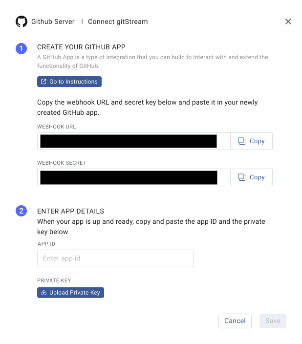
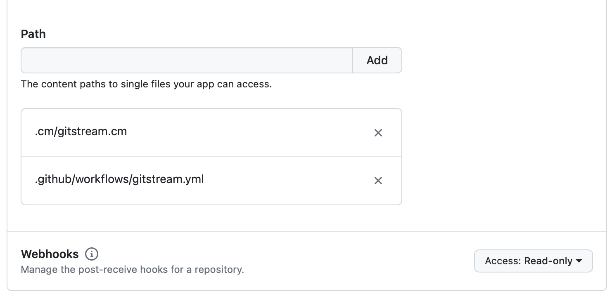
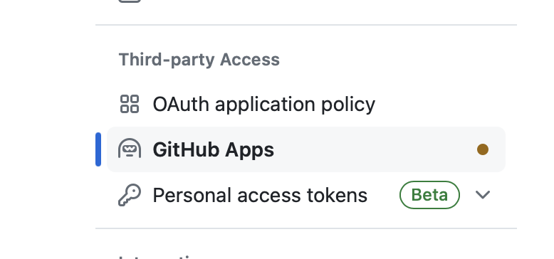
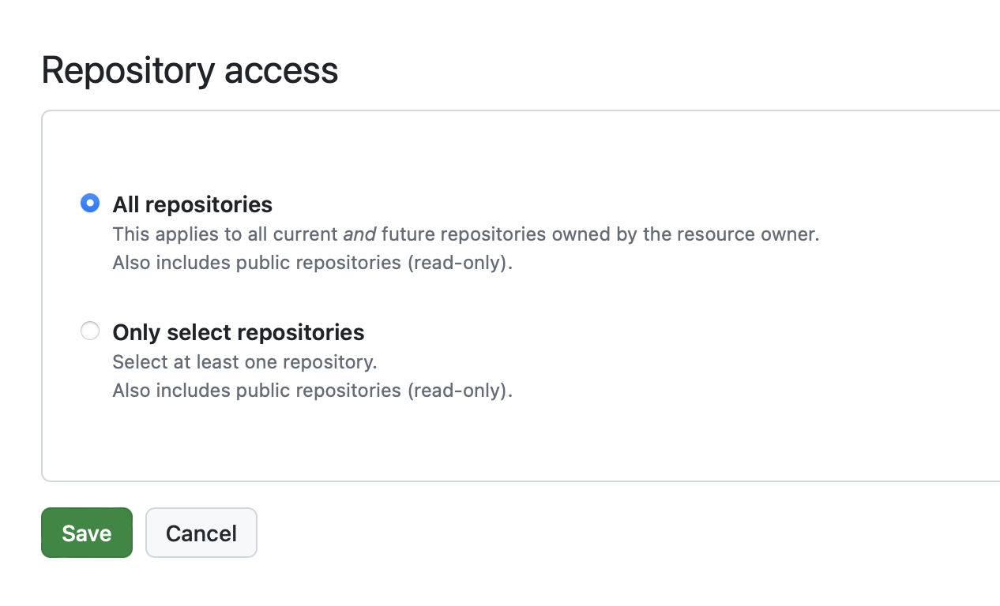

!!! Note

    This guide is for installations on self-hosted GitHub Server. If you are using the gitStream cloud service, please refer to [this guide](github-installation.md).

# Custom GitHub App for Self-Hosted GitHub Server

A GitHub application serves as the link between gitStream and GitHub. It facilitates user authentication via OAuth2 and allows users to select repositories accessible by gitStream.

!!! Info "Prerequisites"

    GitHub Server v3.10 or higher

In this section, we'll guide you through creating a GitHub app for your self-hosted gitStream installation. By the end, you should have noted down the following values:

* App ID
* Private Key

!!! Note

    Throughout this document, when we refer to a GitHub account, it refers to your own GitHub Server installation.

## 1. Connect GitHub Server to LinearB

First <a href="https://app.linearb.io/login" target="_blank">login</a>, or <a href="https://app.linearb.io/sign-up" target="_blank">create a free account</a> on the LinearB app.

In LinearB, go to Settings -> Git -> click the `Connect gitStream` button next to your GitHub Server integration. You’ll need to use the **Webhook URL** and **Webhook secret** later when setting up the GitHub App.

Keep this window open and complete the next steps in GitHub. Once you have the **App ID** and **Private Key** (.pem file), you can complete the connection in LinearB.

## 2. Create a New GitHub App

Any GitHub account can own the app, but we recommend creating it under the organization account of the team who will maintain the gitStream installation.

- Log in to [GitHub](https://github.com/) and go to your organization account page (e.g., `https://github.com/<organization account name>`)
- Click on *Settings -> Developer Settings -> GitHub Apps -> New GitHub App* as shown below
- Or go directly to `https://github.com/organizations/<organization account name>/settings/apps/new`

## 3. Set Up URLs and General Information

Fill in the app information as shown in the screenshot below. For URLs, replace `gitstream.<your-domain>.com` with the actual endpoint at which you'll be hosting the gitStream application.

!!! Warning

    1. Do not forget trailing slashes for the URLs
    2. Do not forget to disable the "Expire user authorization tokens" checkbox
    3. The GitHub App name must contain `gitstream` in lower case

!!! Tip
    Use the following texts:

    1. GitHub App name: `gitstream app`
    2. Homepage URL: `https://gitstream.cm`

!!! Tip
    Use the following texts:

    1. **Webhook URL** from LinearB setup page
    2. **Webhook secret** from LinearB setup page

## 4. Set Up Permissions

We need the following permissions to enable all gitStream functionality:

- **Write access to dedicated gitStream app files:** Used to set up the gitStream workflow files
- **Write access to code:** To allow gitStream to approve PRs once all conditions are met
- **Read access to administration, issues, and metadata:** To get user team membership and branch protection settings
- **Read and write access to actions, checks, pull requests, and workflows:** Trigger workflows, create and update pull requests and their checks, and modify workflow files
- **User email:** Used to identify users                                       |

You need to enable these under the permissions section as shown below:

!!! Tip
    Add the following Path (content paths to single files the app can access):

    1. `.cm/gitstream.cm`
    2. `github/workflows/gitstream.yml`

## 5. Webhook Events and Scope

* Subscribe to events so gitStream is notified when a PR is created, changed, or commented on, etc

!!! Tip

    *"Where can this GitHub App be installed?"* choose *"Any account"* so other orgs in your company can use gitStream as well. For on-prem installations that work with github.com, only repositories under your company's org account can be accessed via gitStream.

## 6. Generate a Private Key

Once the app is created, scroll down and click *Generate private key*. This will create and download a .pem file for you.

!!! Tip

    Please keep this file safe, we'll need to put it back in LinearB setup.

## 7. Upload a Logo

Download the logo file and upload the logo to your app.

- [Black logo](assets/gitstream-black.png)
- [White logo](assets/gitstream-white.png)

## 8. Get App Configuration

On your newly created app page, you can find the App ID.

!!! Tip

    Please keep the App ID, we'll need to put it back in LinearB setup.

## 9. Finish Setup in LinearB

To complete the integration, fill in the App ID and Private Key in the LinearB setup screen.

!!! Tip

    Use the App ID, and Private key (.pem file) to complete the LinearB setup.

## 10. Connect GitHub App to Your Repositories

Go to your organization settings in GitHub and in Third-party Access choose the GitHub Apps. You may need to choose the account to install the gitStream app on. Choose your org you used to create the GitHub app in the previous sections.

Choose the repositories you want to connect.

!!! Tip

    It's recommended to select All repositories, as it covers also future repositories.

## 11. Finish Setting Up gitStream

Follow the instructions to configure your repository using the [GitHub Instructions](github-installation.md)
